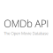

#  OMDb **flow**ground Connector

## Description

A generated **flow**ground connector for the OMDb API (version 1).

Generated from: https://api.apis.guru/v2/specs/omdbapi.com/1/swagger.json 
Generated at: 2019-05-07T17:43:23+03:00

## API Description

The Open Movie Database. The OMDb API is a free web service to obtain movie information, all content and images on the site are contributed and maintained by our users.

## Authorization

This API does not require authorization.

## Actions

### OMDb Search

> Find a movie, series or episode from the OMDb by title, IMDb-id or by free-text search

#### Input Parameters
* `t` - _optional_ - Movie title to search for. One of t, i or s is required.
* `i` - _optional_ - A valid IMDb ID (e.g. tt1285016). One of t, i or s is required.
* `s` - _optional_ - Movie title to search for. One of t, i or s is required.
* `y` - _optional_ - Year of release.
* `type` - _optional_ - Type of result to return.
    Possible values: movie, series, episode.
* `plot` - _optional_ - Return short or full plot.
    Possible values: short, full.
* `tomatoes` - _optional_ - Include Rotten Tomatoes ratings.
* `r` - _required_ - The data type to return.
    Possible values: json, xml.
* `v` - _optional_ - API version (reserved for future use).
* `page` - _optional_ - Page number to return.
* `callback` - _optional_ - JSONP callback name.

## License

**flow**ground :- Telekom iPaaS / omdbapi-com-connector 
Copyright © 2019, [Deutsche Telekom AG](https://www.telekom.de) 
contact: flowground@telekom.de

All files of this connector are licensed under the Apache 2.0 License. For details
see the file LICENSE on the toplevel directory.
